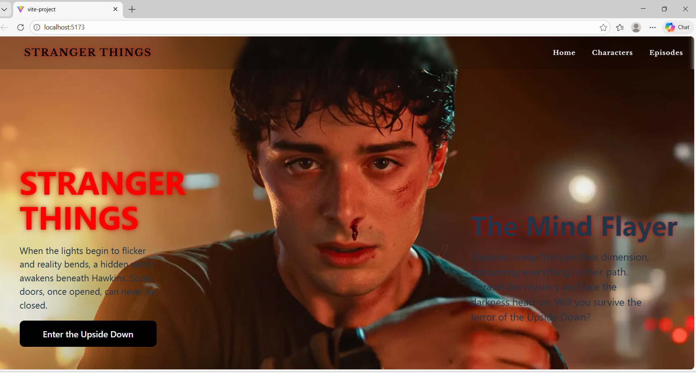
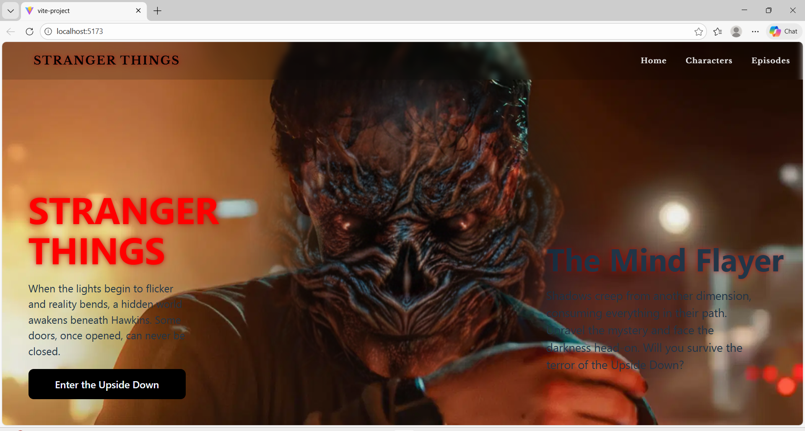

# 🩸 Stranger Things: The Upside Down Experience

When reality glitches and shadows start to move, a hidden world reveals itself.  
This project is a **Stranger Things–inspired interactive web experience** built with **React** and **Framer Motion**, focusing on atmosphere, motion, and mystery.

---

## 🌌 The Idea

Inspired by the eerie world of *Stranger Things*, this project recreates a cinematic hero section where visuals respond to user movement.  
Mouse interactions uncover hidden layers, subtle animations set the mood, and the interface feels alive — just like the Upside Down.

---

## 🧠 What Makes It Special

- Dark, cinematic hero section  
- Mouse-tracking reveal effect (Upside Down vibe 👁️)
- Smooth entrance animations
- Motion-driven storytelling
- Immersive UI inspired by sci-fi horror aesthetics

---

## 🕯️ Experience Preview



---

## ⚡ Features

- Interactive hero section with dynamic reveal
- Smooth text and button animations
- Mouse-based visual effects
- Responsive layout
- Fluid transitions powered by Framer Motion

---

## 🛠 Tech Behind the Scene

- **React.js**
- **Framer Motion**
- **Vite**
- **CSS3**
- **JavaScript (ES6+)**

---

## 🚪 Run It Locally

```bash
git clone https://github.com/sakshijha7850-ops/Stranger-things-web-experience.git
cd Stranger-things-web-experience
npm install
npm run dev
